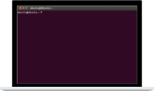

<Section id="header" type="hero">

# Welcome Developer,<br>Node Operator and Miner
This page helps you to get started with æternity.

::: slot buttons

- [Get started](#why)

:::

</Section>

<Section id="why">

## The æternity Blockchain is open source, public and permissionless
If you are already familiar with basic blockchain principles and smart contracts, start with learning
about æternity’s unique features. The æternity protocol ships with a rich set of features
and functionality out of the box.

A full specification and documentation of the protocol can be found in the documentation hub and in the white paper. The source code and latest releases of the æternity node are available on [GitHub](https://github.com/aeternity/aeternity).

::: slot buttons

- [Documentation](https://aeternity.com/documentation-hub/)
- [White Paper](https://github.com/aeternity/white-paper/blob/master/paper.pdf) 

[](https://github.com/aeternity)

:::

</Section>

<Section id="technical_advantages" type="fancy">

## Technical advantages compared to major platforms

<AdvantagesOrbits />

>  
> 
> Reference implementation written in Erlang by industry experts, the language that powers 90% of today’s world wide web. [Learn more](http://erlang.com)

</Section>

<Include path="sections/protocol" />

<Section id="sophia" type="alt">

## Safe smart contract development with Sophia
Sophia is a language in the ML family. It is a strongly typed and has a restricted mutable state. Sophia is a functional Ocaml like language which syntax most resembles that of Reason.

::: slot body

<div class="sophia-content">
    <div class="sophia-graphic">
        
    </div>
<div class="sophia-text">

### What is Sophia?
 Sophia is customized for smart contracts, which can be published to a blockchain (the æternity blockchain). Thus some features of conventional languages, such as floating point arithmetics, are not present in Sophia, and some blockchain specific primitives, constructions and types have been added.

### Links
- [Documentation](https://github.com/aeternity/protocol/blob/master/contracts/sophia.md)
- [Examples on GitHub](https://github.com/aeternity/aepp-sophia-examples)
- [Code Highlighting](https://marketplace.visualstudio.com/items?itemName=MilenRadkov.sophia) for VSCode and other IDE’s

### Educational material

<small>
<a href="https://dacade.org/ae-dev-101/introduction">Online Course from Dacade.org</a><br>
Check out the highly recommended æternity 101 course on Dacade, a peer learning platform.
Courses are free and you will be given a certificate upon completion.
</small>

</div>
</div>

:::    

::: slot buttons

- [Get help](https://forum.aeternity.com)

   in the Forum
- [Chat](https://telegram.me/aeternity)

   in Telegram

:::

</Section>
<Section id="getting_started" type="fancy">

## Getting started

In order to get started, try out the community developed online IDE or setup your own development environment with the local development framework **AEproject**.

- ###  Try it in the browser
  Just click the link below to launch the FireEditor, a Web-based IDE. Start to write and test Sophia smart contracts instantly.
  - 

    [FireEditor](http://fireeditor.nikitafuchs.de)

- ###  Try it locally
  Install it locally and setup your development environment in no-time:
  ```
  npm i -g aeproject
  ```
  - 

    [Documentation](https://github.com/aeternity/aepp-aeproject-js)

::: slot buttons

- [Get help](https://forum.aeternity.com)

   in the Forum
- [Chat](https://telegram.me/aeternity)

   in Telegram

:::

</Section>

<Section id="developer_tools">

## Developer tools
Programming libraries are available. Any Javascript developer can build a simple æternity app in one day. For a quick start and reference SDK it is recommended to use the JavaScript one.

::: slot cards

- 
  ### Node HTTP API

  æternity [Node API](https://api-docs.aeternity.io)
- 
  ### SDK Frontend APIs
  - [JavaScript](https://github.com/aeternity/aepp-sdk-js) (recommended)
  - [Python](https://github.com/aeternity/aepp-sdk-python)
  - [Go](https://github.com/aeternity/aepp-sdk-go)
  - [Java](https://github.com/kryptokrauts/aepp-sdk-java) (Community Maintained)
  - [Elixir SDK](https://github.com/aeternity/aepp-sdk-elixir)
- 
  ### æternal Backend API

  The [æternal](https://github.com/aeternity/aeternal) is a caching and reporting layer which sits in front of the nodes of the æternity blockchain. Its purpose is to respond to queries faster than the node can do, and to support queries that for reasons of efficiency the node cannot or will not support itself.
- 
  ### CLI - Command Line Client

  Quickly test all of Aeternity’s blockchain features from your terminal, you can install and use our [NodeJS CLI](https://github.com/aeternity/aepp-cli-js).

:::

::: slot buttons

- [Get help](https://forum.aeternity.com/c/aepplications)

   in the Forum
- [Chat](https://telegram.me/aeternity)

   in Telegram

:::

</Section>

<Section id="useful" type="alt">

## Useful resources

::: slot cards

- ### Hosted API Server, Public Nodes and Services
  For convenience reasons, there are hosted services available to quick start the development of æternity blockchain applications on testnet. Even though all services are available for mainnet too, it is not advised to use these services in production. Therefore self-hosting critical infrastructure is recommended.
  - Testnet æternal API Server [https://testnet.aeternal.io](https://testnet.aeternal.io)
  - Testnet API Gateway Nodes hosted on [https://testnet.aeternity.io/api](https://testnet.aeternity.io/api)

  > 
  >
  > To get some free AE tokens, use the testnet Token Faucet [https://faucet.aepps.com](https://faucet.aepps.com)

- ### Resources
  - #### Blockchain Explorers (Testnet/Mainnet)
    - **æternal Explorer**
      - Mainnet [https://aeternal.io](https://aeternal.io)
      - Testnet [https://testnet.aeternal.io](https://testnet.aeternal.io)
    - **AEknow**
      - [https://aeknow.org](https://aeknow.org)
  - #### Wallets
    - Browser Waellet [https://waellet.com](https://waellet.com)
    - Mobile Base [https://base.aepps.com](https://base.aepps.com)
    - AirGap [https://airgap.it](https://airgap.it)
    - TrustWallet [https://trustwallet.com](https://trustwallet.com)
    - Atomic Wallet [https://atomicwallet.io](https://atomicwallet.io)
    - Arkane Wallet [https://arkane.network](https://arkane.network)

:::

</Section>

<Section id="interfaces">

## Interfaces and clients

Three major clients to interact with æternity blockchain applications, sign contract calls and do transactions.

::: slot cards

- ### Base iOS/Android/Web Wallet and Browser
  [View on GitHub](https://github.com/aeternity/aepp-base)
- ### Wællet Browser Extension
  [View on GitHub](https://github.com/aeternity/aepp-waellet)
- ### Blockchain Explorers
  - [mainnet.aeternal.io](https://mainnet.aeternal.io)
  - [testnet.aeternal.io](https://testnet.aeternal.io)
  - [www.aeknow.org](https://www.aeknow.org)

:::

::: slot footer

A variety of community build wallets are available, such as:
- [ **Airgap Vault and Wallet**](https://airgap.it)
- [ **Trust Wallet**](https://trustwallet.com)

It is possible to buy æternity tokens on exchanges like Binance, OKex, Huobi, gate.io and many
others. A full list of markets can be found via: <a href="https://coinmarketcap.com">coinmarketcap</a>
- [ binance](https://www.binance.com)
- [ okex](https://www.okex.com)
- [ huobi](https://www.huobi.com)
- [ gate.io](https://www.gate.io)

:::

</Section>

<Section id="run_node" type="alt">

## Run your own node and services

::: slot cards

- 
  ### How to host a Node
  [View docs](https://docs.aeternity.io)
- 
  ### How to host a Middleware API Server
  [View on GitHub](https://github.com/aeternity/aeternal)

:::

</Section>
<Section id="miners">

## For miners, pools and node operators

To get the latest version of æternity node, please check out the [latest published packages](ttps://github.com/aeternity/aeternity/releases) and the [release notes](https://github.com/aeternity/aeternity/tree/master/docs/release-notes).

::: slot cards

- ### Run a node
  [View on GitHub](https://docs.aeternity.io/en/stable/installation/)
- ### Run a mining pool
  [View on GitHub](https://docs.aeternity.io/en/stable/stratum/)
- ### Choose a mining client
  [Choose](https://www.aeknow.org/miner)
- ### Join an existing mining pool
  [Join](https://www.aeknow.org/miner)

:::

</Section>

<Section id="community" type="alt">

## Join the community
- [ Youtube](https://www.youtube.com/channel/UCEsM0b7QPazeMR80DxNkzCA)
- [ Twitter](https://twitter.com/aeternity)
- [ Forum](https://forum.aeternity.com)
- [ Telegram](https://telegram.me/aeternity)
- [ Development grants](https://www.aeternity-foundation.org)

</Section>
